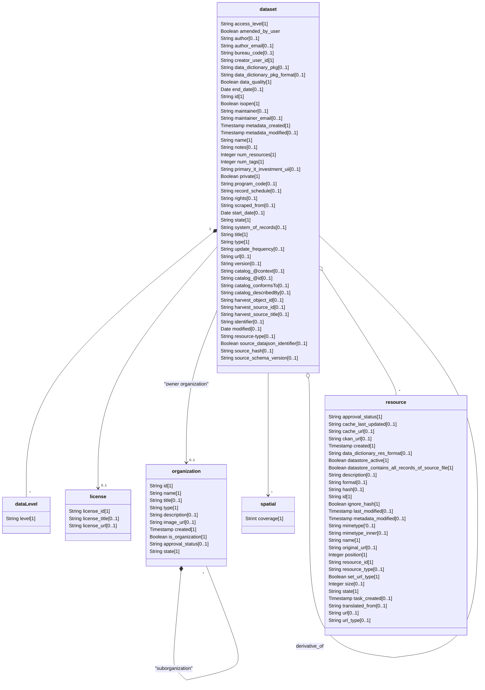

```mermaid
  classDiagram

    class dataLevel {
        String level[1]
    }

    class license {
        String license_id[1]
        String license_title[0..1]
        String license_url[0..1]
    }

    class organization {
        String id[1]
        String name[1]
        String title[0..1]
        String type[1]
        String description[0..1]
        String image_url[0..1]
        Timestamp created[1]
        Boolean is_organization[1]
        String approval_status[0..1]
        String state[1]
      }
      organization *-- "*" organization : "suborganization"

    class spatial {
        Strint coverage[1]
    }

    class dataset {
        String access_level[1]
        Boolean amended_by_user
        String author[0..1]
        String author_email[0..1]
        String bureau_code[0..1]
        String creator_user_id[1]
        String data_dictionary_pkg[0..1]
        String data_dictionary_pkg_format[0..1]
        Boolean data_quality[1]
        Date end_date[0..1]
        String id[1]
        Boolean isopen[1]
        String maintainer[0..1]
        String maintainer_email[0..1]
        Timestamp metadata_created[1]
        Timestamp metadata_modified[0..1]
        String name[1]
        String notes[0..1]
        Integer num_resources[1]
        Integer num_tags[1]
        String primary_it_investment_uii[0..1]
        Boolean private[1]
        String program_code[0..1]
        String record_schedule[0..1]
        String rights[0..1]
        String scraped_from[0..1]
        Date start_date[0..1]
        String state[1]
        String system_of_records[0..1]
        String title[1]
        String type[1]
        String update_frequency[0..1]
        String url[0..1]
        String version[0..1]
        String catalog_@context[0..1]
        String catalog_@id[0..1]
        String catalog_conformsTo[0..1]
        String catalog_describedBy[0..1]
        String harvest_object_id[0..1]
        String harvest_source_id[0..1]
        String harvest_source_title[0..1]
        String identifier[0..1]
        Date modified[0..1]
        String resource-type[0..1]
        Boolean source_datajson_identifier[0..1]
        String source_hash[0..1]
        String source_schema_version[0..1]
    }

    dataset "1" *-- "*" dataLevel
    dataset --> "0..1" license
    dataset --> "0..1" organization : "owner organization"
    dataset --> "*" spatial
    dataset *-- "*" dataset : child_of
    dataset o-- "*" dataset : dependency_of
    dataset o-- "*" dataset : derivative_of
    dataset o-- "*" resource

    class resource {
        String approval_status[1]
        String cache_last_updated[0..1]
        String cache_url[0..1]
        String ckan_url[0..1]
        Timestamp created[1]
        String data_dictionary_res_format[0..1]
        Boolean datastore_active[1]
        Boolean datastore_contains_all_records_of_source_file[1]
        String description[0..1]
        String format[0..1]
        String hash[0..1]
        String id[1]
        Boolean ignore_hash[1]
        Timestamp last_modified[0..1]
        Timestamp metadata_modified[0..1]
        String mimetype['0..1]
        String mimetype_inner[0..1]
        String name[1]
        String original_url[0..1]
        Integer position[1]
        String resource_id[1]
        String resource_type[0..1]
        Boolean set_url_type[1]
        Integer size[0..1]
        String state[1]
        Timestamp task_created[0..1]
        String translated_from[0..1]
        String url[0..1]
        String url_type[0..1]
    }

```
